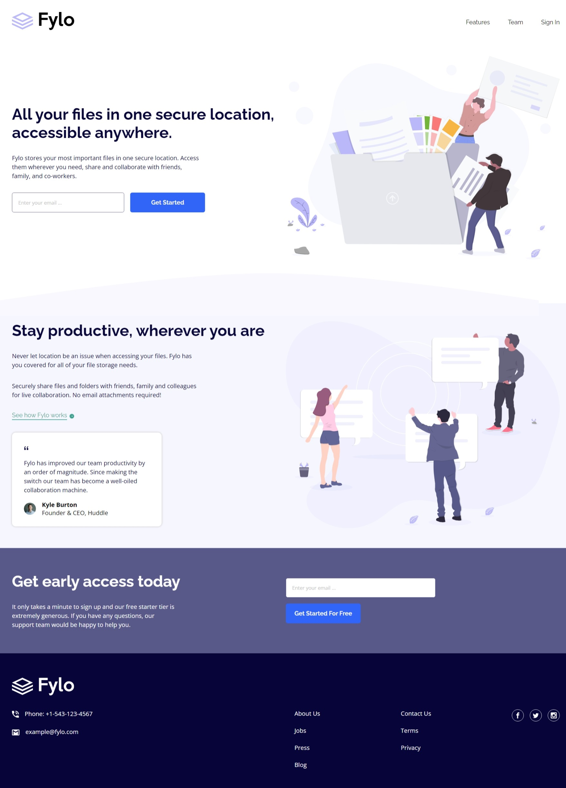

# Frontend Mentor - Fylo landing page with two column layout solution

This is a solution to the [Fylo landing page with two column layout challenge on Frontend Mentor](https://www.frontendmentor.io/challenges/fylo-landing-page-with-two-column-layout-5ca5ef041e82137ec91a50f5). Frontend Mentor challenges help you improve your coding skills by building realistic projects. 

## Table of contents

- [Overview](#overview)
  - [The challenge](#the-challenge)
  - [Screenshot](#screenshot)
  - [Links](#links)
  - [Built with](#built-with)
  - [Continued development](#continued-development)
- [Author](#author)

## Overview
  - This is a single landing page that comprise of an input field where a user can enter an email to sign-up and a single testimonial card.
### The challenge

Users should be able to:

- View the optimal layout for the site depending on their device's screen size
- See hover states for all interactive elements on the page

### Screenshot

### Links

- Solution URL: (https://github.com/Oppy09/fylo-landing-page-with-two-column-layout-master)
- Live Site URL: (https://oppy09.github.io/fylo-landing-page-with-two-column-layout-master/)

### Built with

- Semantic HTML5 markup
- CSS custom properties
- Flexbox
- Media query
### Continued development

- I want to learn how to create the active states for the input (check if the email is of type email and give an error message if not) when the buttons are being clicked
## Author

- Frontend Mentor - [@Oppy09](https://www.frontendmentor.io/profile/Oppy09)
- Twitter - [@AderinolaOpemi5](https://www.twitter.com/AderinolaOpemi5)
